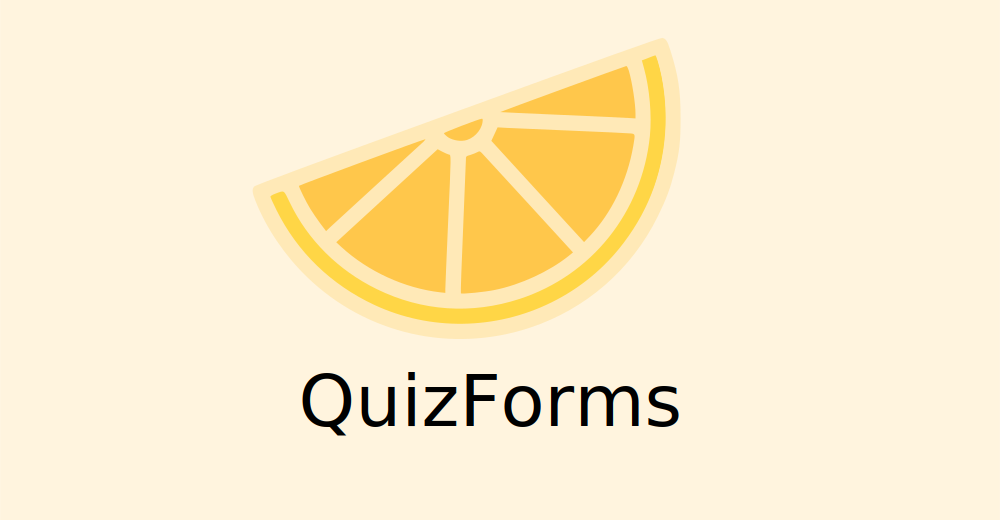
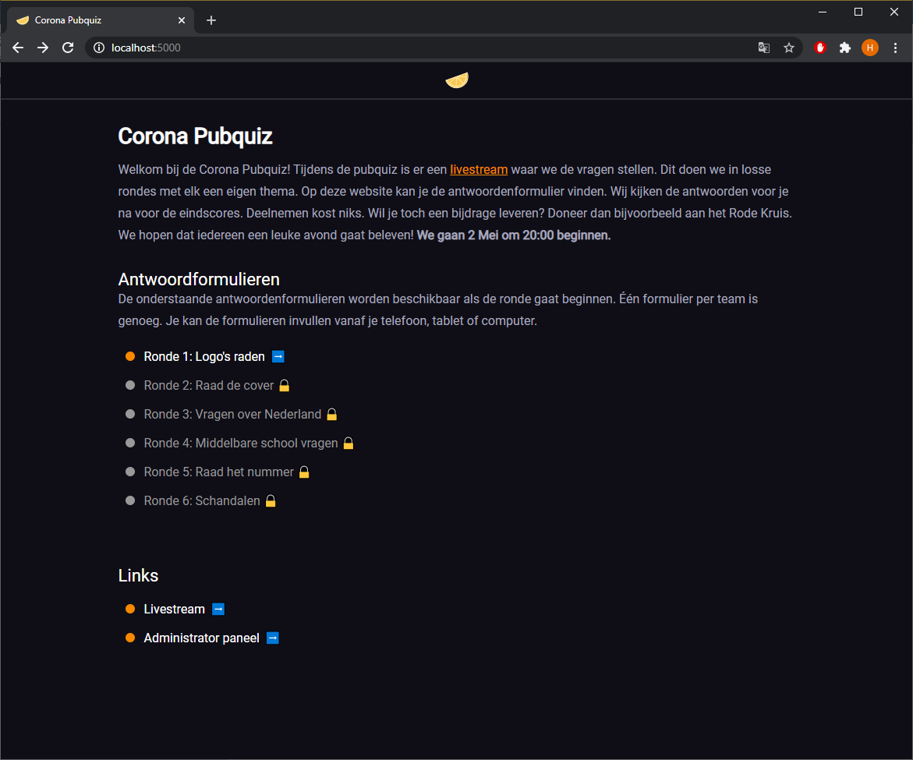
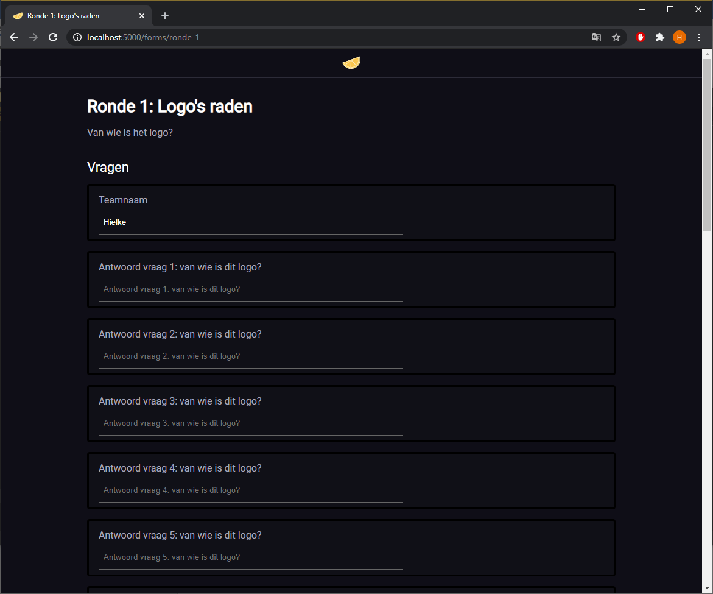
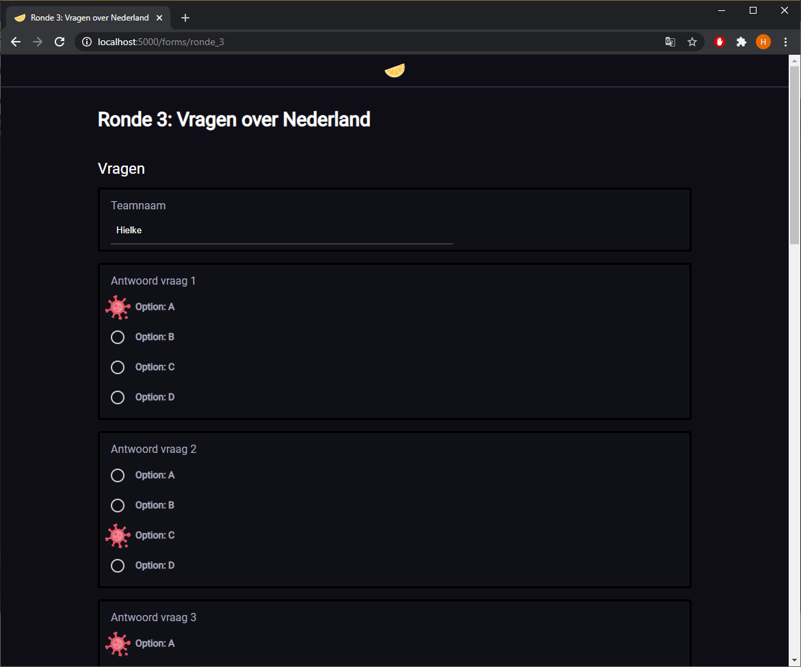
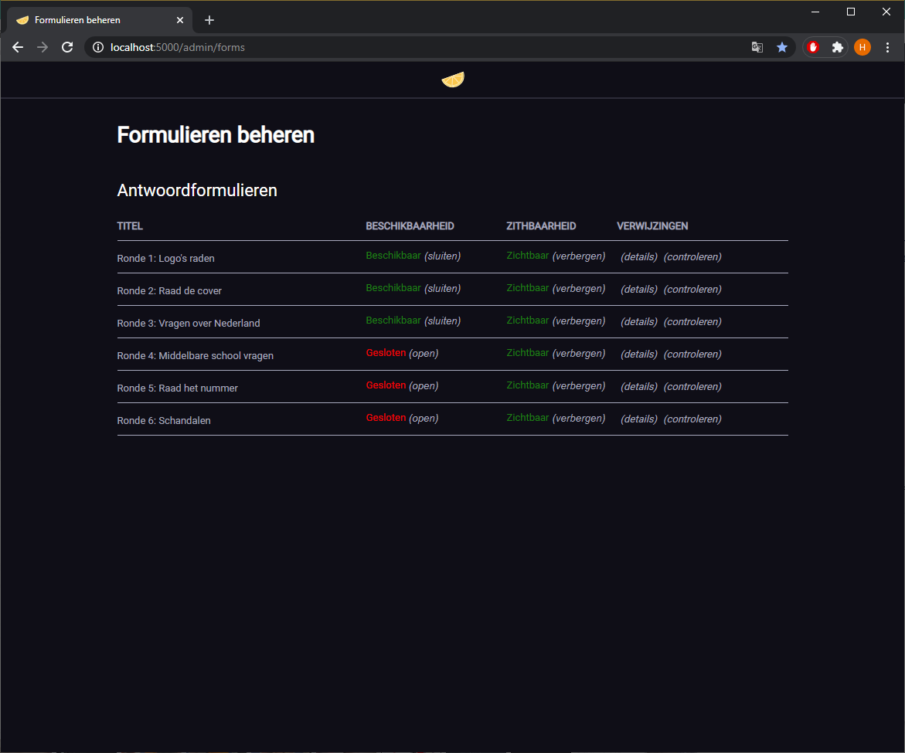
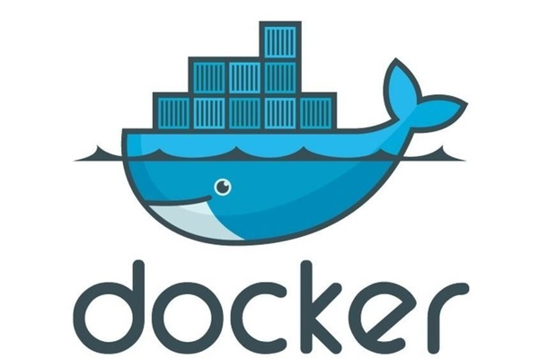

## Introduction

## Screenshots

| | |
|:---|:---|
|   |  |
|  |  |

## Tech Stack
- .NET Core 3.1
- ASP.NET Core
- Sass (scss)
- HTML, JavaScript, Css
- Docker
- PowerShell

## Requirements
Only `Docker` and `PowerShell` are required to build and run QuizForms.

## Docker
QuizForms uses Docker to compile and run.



### Build and run container
Run this *PowerShell* command to build and start the Docker container for QuizForms.

```
.\build.ps1; .\run.ps1
```

### Build container
Run this *PowerShell* command to build the Docker container for QuizForms.

```
.\build.ps1;
```

### Run container
Run this *PowerShell* command to start the Docker container for QuizForms.

```
.\run.ps1
```

### List active containers
Run this *PowerShell* command to list the active contains.

```
docker ps
```

### Stop container
Run this *PowerShell* command to stop the QuizForms Docker container.

```
docker stop quizformsapp
```